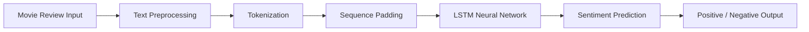

# 🎬 IMDB Movie Review Sentiment Predictor

<div align="center">


# 🚀 Deep Learning Powered NLP Sentiment Analysis System

### Predict Movie Review Sentiment using LSTM Neural Networks & Streamlit

<p align="center">
  
  
  
  
</p>

<p align="center">
  <a href="https://github.com/Ajay-hb/IMDB-Movie-Review-Sentiment-Predictor/stargazers">
    
  </a>
  <a href="https://github.com/Ajay-hb/IMDB-Movie-Review-Sentiment-Predictor/network/members">
    
  </a>
</p>

---

</div>

# 🌟 Overview

This project is a **Deep Learning based NLP Web Application** that predicts whether a movie review is **Positive** or **Negative** using a trained **LSTM Neural Network**.

The application is built with:

* 🧠 TensorFlow & Keras
* 🎯 LSTM Deep Learning Architecture
* ⚡ Streamlit Interactive UI
* 📊 Natural Language Processing Techniques
* 🚀 Real-Time Prediction System

---

# ✨ Live Demo

<div align="center">

## 🔗 Deploy Link

```bash
https://your-streamlit-app-link.streamlit.app
```

</div>

---

# 🖥️ Application Preview

<div align="center">


</div>

---

# ⚡ Features

## 🎯 Core Features

✅ Real-Time Sentiment Prediction
✅ Deep Learning LSTM Architecture
✅ NLP Text Preprocessing Pipeline
✅ Probability-Based Predictions
✅ Interactive Streamlit Interface
✅ Lightweight & Fast Inference
✅ Deployment Ready

---

# 🧠 Deep Learning Workflow

<div align="center">



</div>

---

# 🏗️ Model Architecture

```python
model = Sequential([
    Embedding(input_dim=10000, output_dim=32, input_length=200),
    LSTM(32),
    Dense(1, activation='sigmoid')
])
```

---

# 🛠️ Tech Stack

<div align="center">

| Technology         | Usage                    |
| ------------------ | ------------------------ |
| Python             | Core Programming         |
| TensorFlow / Keras | Deep Learning            |
| Streamlit          | Web Application          |
| NumPy              | Numerical Computing      |
| NLP                | Text Processing          |
| LSTM               | Sentiment Classification |

</div>

---

# 📂 Project Structure

```bash
IMDB-Movie-Review-Sentiment-Predictor/
│
├── app.py
├── lstm_sentiment_model.h5
├── requirements.txt
├── runtime.txt
├── README.md
```

---

# ⚙️ Installation Guide

## 1️⃣ Clone Repository

```bash
git clone https://github.com/Ajay-hb/IMDB-Movie-Review-Sentiment-Predictor.git
```

---

## 2️⃣ Navigate to Project Folder

```bash
cd IMDB-Movie-Review-Sentiment-Predictor
```

---

## 3️⃣ Install Dependencies

```bash
pip install -r requirements.txt
```

---

## 4️⃣ Run Streamlit Application

```bash
streamlit run app.py
```

---

# 📦 Requirements

```txt
streamlit==1.57.0
tensorflow-cpu==2.16.1
numpy==1.26.4
h5py==3.11.0
```

---

# 📊 Example Predictions

<div align="center">

| Movie Review                           | Prediction |
| -------------------------------------- | ---------- |
| Amazing acting and storyline           | ✅ Positive |
| Worst movie I have ever watched        | ❌ Negative |
| Fantastic visuals and emotional ending | ✅ Positive |
| Boring and slow screenplay             | ❌ Negative |

</div>

---

# 🚀 Deployment Platforms

<div align="center">

| Platform                  | Status      |
| ------------------------- | ----------- |
| Streamlit Community Cloud | ✅ Supported |
| Hugging Face Spaces       | ✅ Supported |
| Render                    | ✅ Supported |
| Railway                   | ✅ Supported |

</div>

---

# 🔥 Future Improvements

✅ Bidirectional LSTM
✅ Attention Mechanism
✅ BERT / Transformer Integration
✅ Confidence Score Visualization
✅ Advanced Analytics Dashboard
✅ Dark Theme UI
✅ Review History Storage

---

# 📈 Why This Project Matters

This project demonstrates:

* Deep Learning Fundamentals
* NLP Pipeline Development
* Sequence Modeling using LSTM
* Streamlit App Deployment
* Real-Time Inference Systems
* End-to-End AI Product Development

---

# 👨‍💻 Author

<div align="center">

# Ajay Ponnuru

### Data Science | Deep Learning | AI Engineer

<p>
  <a href="https://github.com/Ajay-hb">
    
  </a>

  <a href="https://linkedin.com">
    
  </a>
</p>

</div>

---

# ⭐ Support

If you found this project useful:

🌟 Star this repository
🍴 Fork this repository
📢 Share with others

---

<div align="center">

# 🚀 Built with Deep Learning & Passion for AI


</div>
